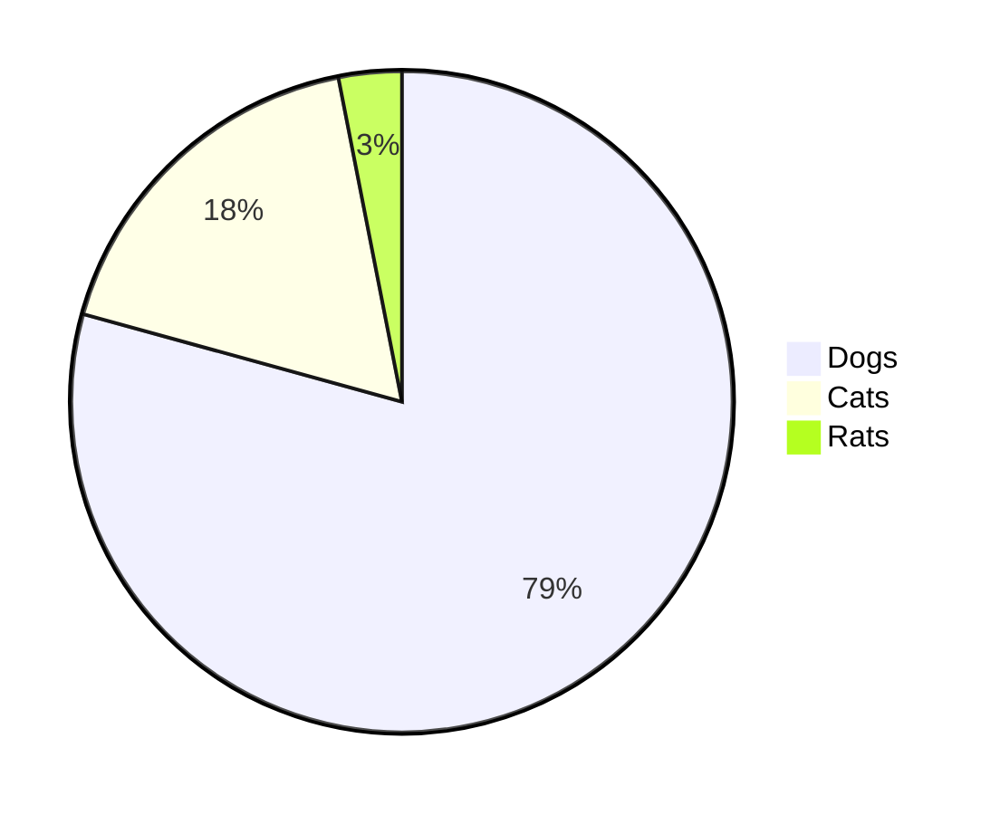

# first level heading

## second level heading

### third level heading

**Bold**
_Italic_
~~Strikethrough~~
log10<sup>2</sup>
log<sub>2</sub>10

> Quote

```
git init
git status
git log
```

```javascript
const fullName = "Bikram Keshari Maharana";
const lowerCaseFullName = fullName.toLowerCase();
console.log(lowerCaseFullName);
```



| First Header | Second Header |
| ------------ | ------------- |
| Content Cell | Content Cell  |
| Content Cell | Content Cell  |

[GitHub Pages Link](https://pages.github.com/)

- first level list
  - second level list

* [ ] task one
* [x] task two
* [ ] task three

> [!NOTE]
> Useful information that users should know, even when skimming content.

> [!TIP]
> Helpful advice for doing things better or more easily.

> [!IMPORTANT]
> Key information users need to know to achieve their goal.

> [!WARNING]
> Urgent info that needs immediate user attention to avoid problems.

> [!CAUTION]
> Advises about risks or negative outcomes of certain actions.
